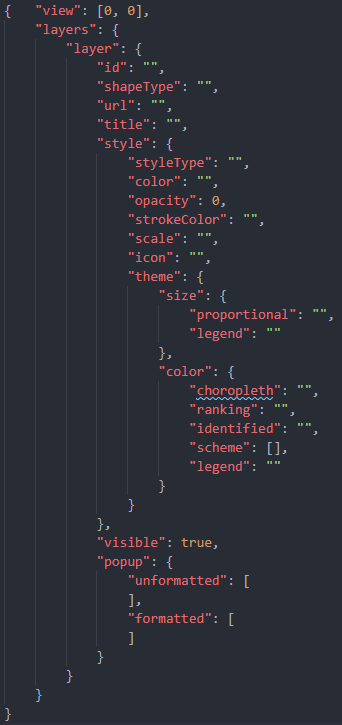
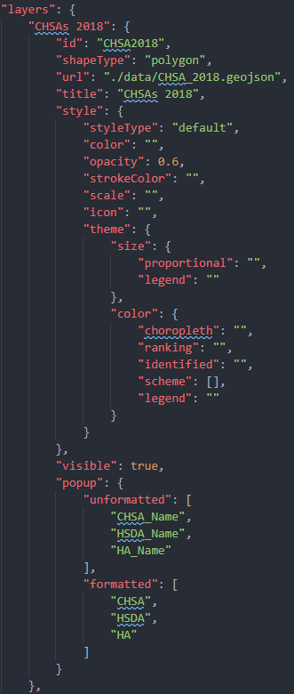
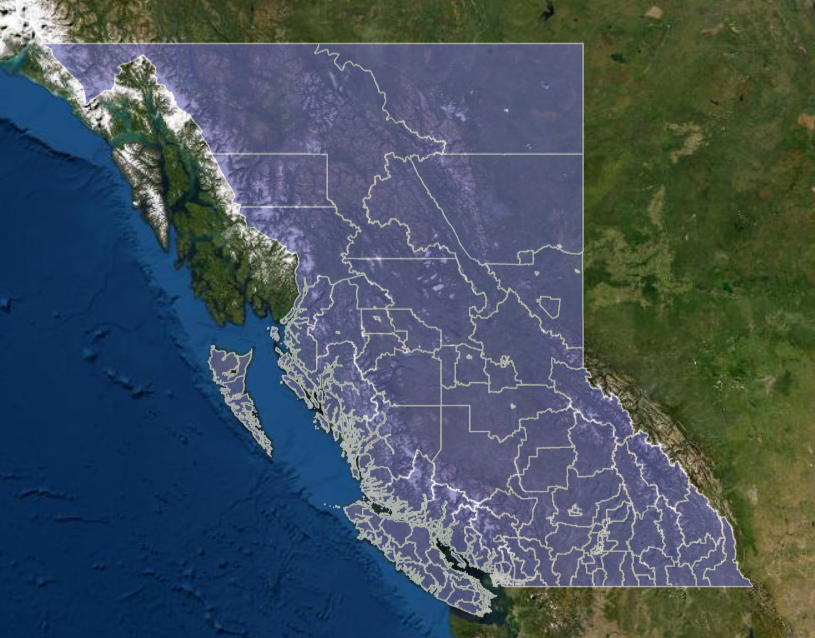
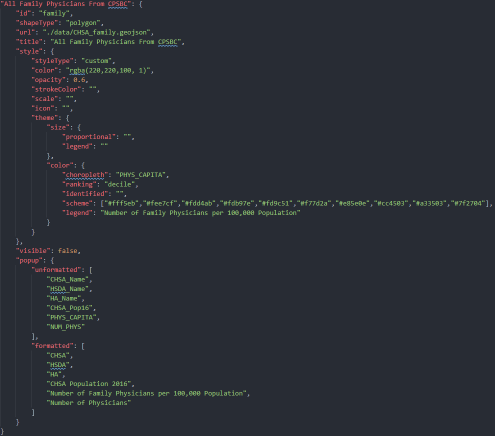
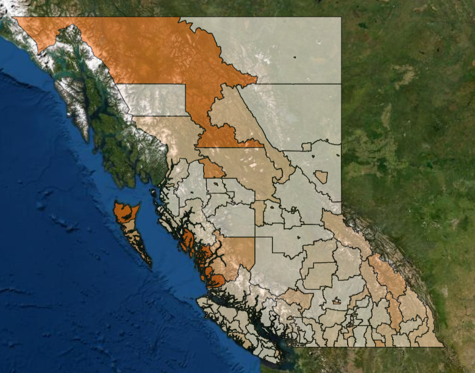
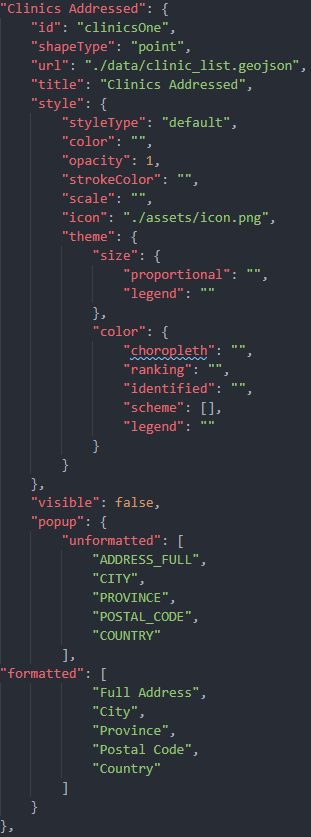
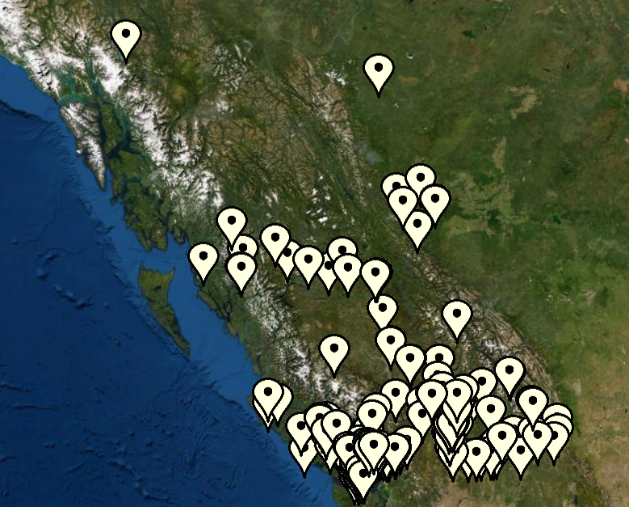
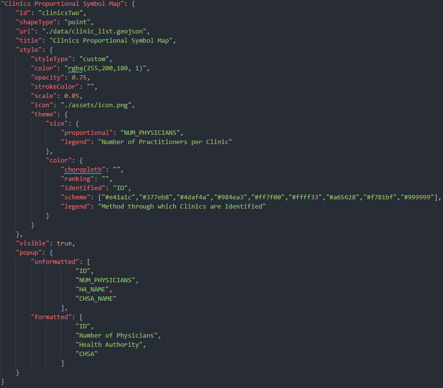
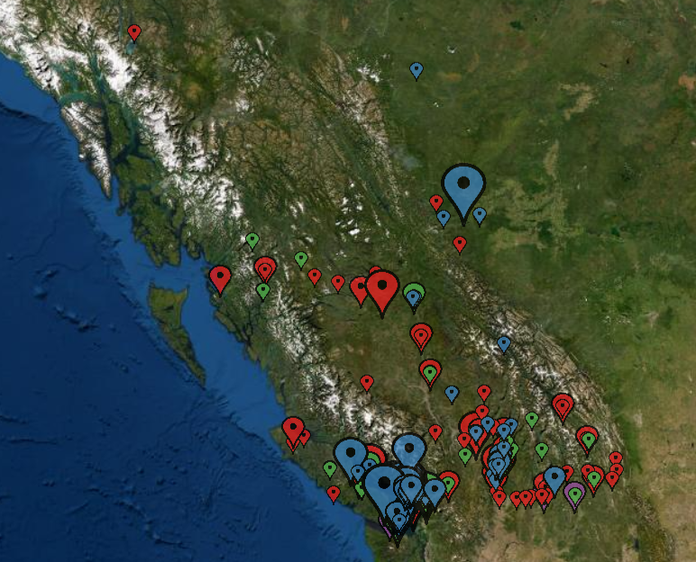

# CAMP Clinic List Map Choropleth

Click to access the [CAMP Clinic List Map Choropleth](https://isu-ubc.github.io/clinic-mapping-2/)

**Note**: If you're on mobile, rotate your device for best experience. 

## Description

This application hosts two layers to toggle through. One layer maps the number of family physicians per 100,000 based on the clinic list, and the other maps the number of family physicians per 100,000 based on the family physician list from CPSBC. The theme for both layers is [choropleth](https://sites.google.com/site/boardinclassrom/map/choropleth-map). 

## Features of the Application

- Map Container 
  - A view over some geography
  - View feature layers (points, and / or polygons)
  - Base maps 
  - OpenLayer Controls
    - Layer switcher to hide / show layers and base maps
    - Zoom in / out
    - Map scale
    - Full screen mode
    - Popup to show information of the clicked feature in a layer
    - Legend

## Getting Started

### Project Development

1. Clone the repo to your desired file directory
2. Download [Web Server for Chrome](https://chrome.google.com/webstore/detail/web-server-for-chrome/ofhbbkphhbklhfoeikjpcbhemlocgigb) or [Live Server in VSCode](https://marketplace.visualstudio.com/items?itemName=ritwickdey.LiveServer)
3. Open the web app in your preferred text editor if using Web Server for Chrome, otherwise use VSCode
4. Use [Chrome DevTools](https://developers.google.com/web/tools/chrome-devtools/) for debugging
   - Ensure that cache is disabled in DevTools
5. Ensure the languages you work with are included in the system PATH

### Feeding the Application Information

#### The JSON

JSON files are an excellent way to transmit information to a web application. For the sake of this web application, the JSON file is used to send information locally so that the map container can be filled as desired. Therefore, this web application is built so users don't have to touch code. Users instead open up the JSON and enter in the details required for their visualization. You can see in the image below what our empty ```application.json``` file looks like. The explanations may get complex so examples are provided if you want to get started quickly. 



###### View

In the first part of the JSON, you must choose a view. The view is where you want the map to be centred. The coordinates for the view are in the form of longitude and latitude.

###### Layers

In the second part of the JSON, each layer you wish to add to the map container will have to be stored in the ```layers``` object. The ```layer``` object should be renamed to whatever you plan on titling the layer as. 

Each ```layer``` also has attributes that may need to be filled. The ```id``` is for the code to identify your layer in the code whereas the ```title``` is more for the layer switcher, and popups. 

Next, the ```shapeType``` is dependent on the GeoJSON vector data. The data can be ```point``` or ```polygon``` (see [Types of GIS Data Explored: Vector and Raster](https://www.gislounge.com/geodatabases-explored-vector-and-raster-data/)). You have to write this in yourself so that the feature layer can be styled appropriately. To load the GeoJSON file into the map container, you'll need the ```url``` (or file path). For example, the url could be something like ```./data/someFile.geojson```. 

###### Layer Styling

The ```style``` object is the important part of your visualization. The ```styleType``` can be custom or default. If you set the the ```styleType``` to default then the program will set the feature layer to the default theme based on the ```shapeType```. If the ```styleType``` is set to custom then you can either select a single rgba ```color``` yourself or create a thematic (```theme```) feature layer. 

The ```opacity``` can be any number you want in the range of 0 to 1 and must be set for any ```styleType``` whether default or custom. 

The ```strokeColor``` will also depend on your ```styleType```. If you didn't use the default then you have to choose an rgba color for the ```strokeColor``` yourself. 

The ```scale``` and ```icon``` attributes depend on your ```shapeType```. You should only fill these two out if your feature layer is of the type ```point```. The ```scale``` value will be dependent on the size of the png itself, so if a scale of **0.05** shows the png as too large then you may need to update the ```GetProportionFn()``` in ```scales.js``` as the function is only currently designed for the Point Marker png we're using. The ```icon``` attribute should be set to the url or filepath of the icon you wish to use. 

The ```theme``` attribute is likely the most complex of all the attributes. If you would like to do proportional symbol mapping, then you must fill in attributes for the ```size``` object. Ensure that only ```point``` data is used for this kind of thematic mapping. The ```proportional``` value should be whichever feature layer attribute column you're targeting in the GeoJSON file for the thematic mapping. For example, if you want to do proportional mapping by population size, your GeoJSON file might have a column title called ```pop_2020``` that you want to target. Next, if you wanted to do some form of color mapping, such as choropleth, you'd want to fil in some of the attributes in the ```color``` object. You can only color two ways here, either ```choropleth``` or ```identified```. Similar to ```proportional```, you want to target either one of these themes using the attribute column title of interest. If you were to thematically identify each type of family hospital in a region, you could target something like ```ID``` for the ```identified``` attribute. If you want to thematically map something per capita you would use ```choropleth``` and look to target something like ```num_dentists_by_pop``` in your GeoJSON and then set a ```ranking```. The ```ranking``` value is either ```quartile```, ```quintile```, or ```decile```. Obviously, this depends on your preference. The ```scheme``` value should be whichever color scheme you'd like for this thematic visualization. The resources at the bottom of the README have good examples of color schemes for web mapping. Lastly, the ```legend``` attribute is what you might want to label the theme as in the legend. 

**Note:** You can have a ```proportional``` symbol map that is also a ```choropleth``` or ```identified``` map. All depends on whether you want 1 or 2 themes for your feature layer. Just remember you can't have 3 themes set at the same time. 

###### Layer Visibility

To show the feature layer in the map container, ```visible``` should be set to ```true```. Otherwise, use ```false```. Don't forget that if you're adding multiple layers, polygon feature layers should be visible before point feature layer layers. 

###### Layer Popups

In the ```popup``` object you have two things to take note of. The ```unformatted``` array should contain titles of any attribute columns that interest you to show in the popup from the GeoJSON file and the ```formatted``` array are for those titles to be written in plain english since GeoJSON attribute column titles generally aren't pretty. 

#### Polygon Layer Styling
##### Default





##### Custom





#### Point Layer Styling

##### Default





##### Custom





### File Conversions and Data Handling 

##### Setup

1. Install [*Anaconda Navigator*](https://www.anaconda.com/)
2. Get GeoPandas
   - Open *Anaconda Prompt* as admin and create a new environment called ```geo_env```.
     - See full commands for this step at [*GeoPandas Getting Started*](https://geopandas.readthedocs.io/en/latest/getting_started/install.html#creating-a-new-environment)
3. Next, open *Anaconda Navigator* and click on ```Home``` and set ```Applications on``` to ```geo_env``` instead of ```base (root)```. 
   - Click the ```install``` button for *Spyder* in the *Anaconda Navigator*. 
4. After all these steps you should be ready to run the new environment in Spyder for Python scripting.
     - Additionally, run the following command in the Spyder terminal:  ```pip install openpyxl```

##### Scripts 

In the ```scripts``` folder you'll find Python files for converting SHP to GeoJSON, and Excel to GeoJSON. You'll also find scripts for cleaning up values in a GeoJSON and for adding new data to a GeoJSON. 

## Authors

[Innovation Support Unit - Department of Family Practice at UBC](https://isu.familymed.ubc.ca/)

[Omar Kawach - Consultant](https://omarkawach.github.io/)

## Credit and Acknowledgements

[Bruno St-Aubin at Statistics Canada - Components](https://github.com/SGC-CGS/geo-explorer)

[OpenLayers - Source Code](https://github.com/openlayers/openlayers)

[Jean-Marc Viglino - OpenLayers Extension](https://github.com/Viglino/ol-ext)

[Matt Walker - OpenLayers LayerSwitcher](https://github.com/walkermatt/ol-layerswitcher)

[White Google Maps Pin](http://www.clker.com/clipart-white-google-map-pin-1.html)

## Resources

#### Styling

[D3 Color Schemes](https://observablehq.com/@d3/color-schemes)

[ColorBrewer Cartography Color Advice](https://colorbrewer2.org/#type=sequential&scheme=BuGn&n=3)

#### GIS

[Spatial References](https://spatialreference.org/ref/epsg/)

#### OpenLayers

[OpenLayers Documentation](https://openlayers.org/en/latest/doc/)